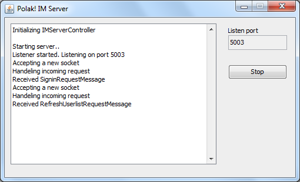
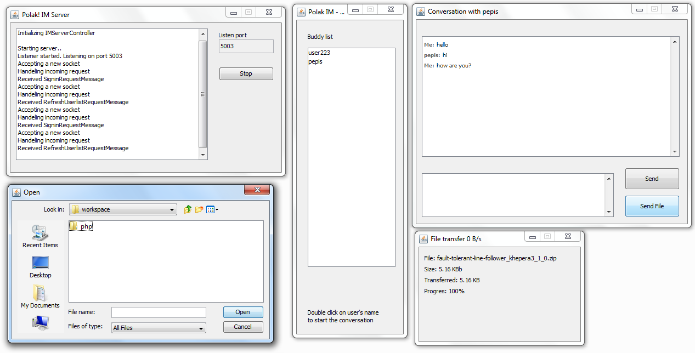

# PolakIM - Java instant messenger

## About

The software consists of the server and clients. Server's role is to keep track of logged users and to distribute the user lists among all the logged users. File list server is not involved in sending/receiving user messages. Clients' communication is peer-to-peer. User list storied on the main server consists of the hash map taking username as a key and the value consisting of an array containing IP address and client's listen port.

Any client can communicate between the server and the other clients. Each client is identified by unique username. Client communication is based on exchange of serialized objects (messages). Every client implements a server for incoming messages.

File transfer between two clients is implemented in the following way: 1 sending file transfer header (serialized object), 2 waiting for the acceptance, 3 sending the file as raw binary stream.

The GUI of the client is implemented on thread independent on the communication threads. Most of the communication is asyncronous.

## Features

* Messages send as serialized objects
* Server used only for registering/updating userlist
* Clients communication is P2P
* Implemented Server, Client, GUI (Swing), File transfer, SSL

## Application constraints

The client must have a "visible IP" since the IM communication is p2p - the NAT traversal is not possible without port mapping.

## Logic of the client

The content of this section is outdated.

*IMServer* - the base class containing the main method. The main method contains the listening loop (using Java ServerSocket).

For each incomming connection there is an IMServerThread instance created. IMServerThread exstends the Thread class and takes the incomming socket connection as the parameter. The reason for this is that having many threads we can threat many incomming connections in parallel. IMServerThread acts as an action handeler.

The IMServerThread reads a serialized object and takes an action based on the object type. Basically there are 3 types of the incomming objects:

* IMMessage - a common text message
* UserListMessage - user list sent by the server
* FileTransferHeader - a header for the following file transfer
* CustomServerMessage - server messager, errors etc

## GUI

### Server window

### Client windows

## Known Issues

* SSL without authentification (no certificates)
* Issues with message exchange protocol (sources of messages are not verified thus message sender can be spoofed)
* Swing KeyListeners are not implemented

A distributed systems project (2008)